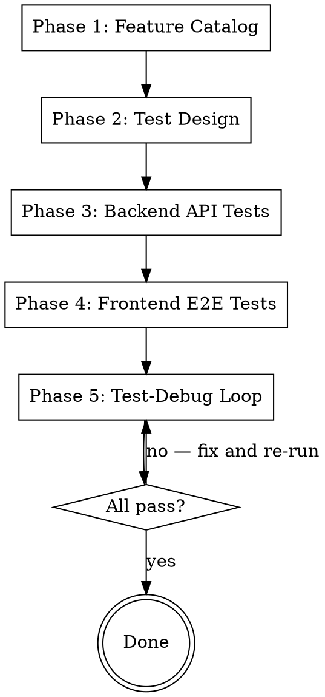
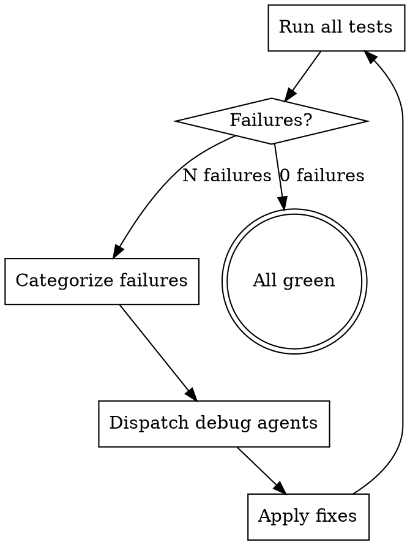

# Acceptance Testing

## Overview

Systematic feature verification from the **user's perspective**. Every test proves a feature works as a user would experience it — not just that internal code runs.

**Core principle:** Code is truth, docs are reference. Catalog features by reading code, design tests from user input to visible output, execute in layers (backend → frontend), debug in tight loops. Each phase uses specialized agent teams. **Never stop until all tests pass.**

## When to Use

- After implementing features, before release
- User asks to "verify", "test everything", "QA", "acceptance test"
- After major refactoring affecting multiple screens/endpoints
- Need proof that all features work end-to-end

## Process



## Phase 1: Feature Catalog

**Goal:** Build a complete list of what to test by reading actual code.

**Method:** Create a team with parallel Explore agents:

| Agent | Reads | Extracts |
|-------|-------|----------|
| Frontend Explorer | All screens, components, navigation | Every user-visible feature, interaction, data display |
| Backend Explorer | All endpoints, services, models | Every API endpoint, request/response format, error handling |
| Docs Explorer | PRD, UX design doc, CLAUDE.md | Feature requirements, acceptance criteria (reference only) |

**Output:** Feature matrix — each row is one testable feature with:
- Feature ID + name
- User-visible behavior (what does the user see/do?)
- Entry point (which screen/endpoint)
- Dependencies (API calls, stores, navigation)

**Rule:** If code implements it, it goes in the matrix. Docs that mention unimplemented features are excluded.

## Phase 2: Test Design

**Goal:** For each feature, define a test that proves it works **from user perspective**.

**Principles:**
1. **Test Pyramid** — More API tests (fast, reliable), fewer E2E tests (comprehensive but slower)
2. **User perspective** — Test inputs users provide, outputs users see
3. **Risk-based priority** — Core flows first, edge cases second
4. **Each test = one feature** — If test passes, that feature works
5. **User journey coverage** — In addition to per-feature tests, design at least one end-to-end test that walks the **complete user journey** from first use to result

**User Journey Test (required if journey exists in docs):**

Read `docs/plans/*-ideation.md` → 「本质任务分析 → 用户旅程」section (or `*-ui.md` → 「用户流程」). If a user journey is documented, create a dedicated E2E test that walks through the entire journey sequentially:

```
TEST: Complete User Journey
LAYER: frontend-e2e
STEPS:
  1. [Journey step 1 — e.g., connect account]
  2. [Journey step 2 — e.g., select repo]
  3. [Journey step 3 — e.g., configure rules]
  ...
ASSERT:
  - Each step transitions cleanly to the next
  - Data created in step N is available in step N+1
  - Final step produces the expected end result
```

This test catches **inter-feature breakage** that per-feature tests miss — one feature works alone but the handoff between features is broken.

**Test specification format:**
```
TEST: [Feature Name]
LAYER: backend-api | frontend-e2e
PRECONDITION: [Setup needed]
STEPS:
  1. [User action or API call]
  2. [Expected response or UI change]
ASSERT:
  - [Specific verifiable outcome]
  - [Specific verifiable outcome]
```

**Split into two test suites:**

### Backend API Test Suite
- One test per endpoint (happy path)
- Error handling tests (404, 400, validation)
- Multi-step workflow tests (upload → analyze → get result)
- Data integrity tests (saved data matches retrieved data)

### Frontend E2E Test Suite
- One test per screen (renders correctly)
- One test per user flow (navigation + interaction)
- State tests (theme toggle, filters, data persistence across screens)
- Integration tests (frontend calls backend, displays result)

## Phase 3: Backend API Tests

**Goal:** Prove all API endpoints work correctly.

**Execution:** Create a team:

| Agent | Task |
|-------|------|
| Test Writer | Implement all backend API tests using project's test framework |
| Test Runner | Run tests, collect results, report failures |

**Framework preference:** Use whatever the project already uses (pytest, jest, etc). If none exists, pytest for Python, vitest for JS/TS.

**Key patterns:**
- Use test client (FastAPI TestClient, supertest) — no real server needed
- Test the full request→response cycle, not internal functions
- Assert status codes, response schema, and actual values
- Chain dependent tests: create → read → update → delete

**Output:** All backend tests passing, or a list of failures with error details.

## Phase 4: Frontend E2E Tests

**Goal:** Prove all screens render and interactions work.

**Tool selection (in order of preference):**
1. **Playwright** (if web mode available — Expo Web, Next.js, etc.)
2. **Cypress** (web apps)
3. **Maestro** (native mobile, requires Mac for iOS)
4. **Detox** (React Native with simulator)

**For Expo/React Native projects:** Use `npx expo start --web` + Playwright. Limitations:
- Camera/native sensors won't work → use file upload or mock
- Some RN components render differently → focus on logic, not pixel-perfect

**Execution:** Create a team:

| Agent | Task |
|-------|------|
| Setup Agent | Start dev servers (backend + frontend), verify connectivity |
| Test Writer | Implement E2E test scripts |
| Test Runner | Execute tests via Playwright/browser, capture screenshots on failure |

**Key patterns:**
- Use accessibility snapshots over screenshots for assertions
- Wait for content to appear, don't use arbitrary timeouts
- Take screenshots on failure for debugging
- Test one flow per test function — keep tests independent

**Output:** All E2E tests passing, or failure screenshots + error details.

## Phase 5: Test-Debug Loop

**Goal:** Fix every failing test until all pass.



**Categorize failures:**
- **Test bug** — Test itself is wrong (bad selector, wrong assertion)
- **Missing feature** — Feature not implemented or partially implemented
- **Regression** — Feature broke due to other changes
- **Environment** — Server not running, wrong port, missing dependency

**Debug with parallel agents:** One agent per independent failure domain. Each agent:
1. Reads the failing test + error message
2. Reads the relevant source code
3. Identifies root cause (using superpowers:systematic-debugging)
4. Proposes minimal fix
5. Returns: root cause + fix + files changed

**After fixes:** Re-run ALL tests (not just the fixed ones) to catch regressions.

**Loop termination:** All tests pass. No manual "good enough" — every test must be green.

## Team Structure

For maximum efficiency, use this team layout:

```
Team Lead (you)
├── Phase 1: 3 parallel Explore agents (frontend, backend, docs)
├── Phase 2: 1 Plan agent (designs all tests)
├── Phase 3: 1 general-purpose agent (writes + runs backend tests)
├── Phase 4: 1 general-purpose agent (writes + runs E2E tests)
└── Phase 5: N parallel general-purpose agents (one per failure domain)
```

Each phase completes before the next starts. Within a phase, agents run in parallel where possible.

## Anti-Patterns

| Don't | Do Instead |
|-------|-----------|
| Test internal functions | Test user-visible behavior |
| Skip failing tests | Fix the code or fix the test |
| Write tests from docs alone | Read code first, use docs as reference |
| Stop at "mostly passing" | Loop until 100% green |
| Fix everything sequentially | Parallelize independent failures |
| Test only happy paths | Include error states, empty states, edge cases |
| Manually verify and declare done | Automated tests or it didn't happen |

## Quick Reference

| Phase | Input | Output | Team |
|-------|-------|--------|------|
| 1. Catalog | Codebase | Feature matrix | 3 Explore agents |
| 2. Design | Feature matrix | Test specs (backend + E2E) | 1 Plan agent |
| 3. Backend | Test specs | Passing API tests | 1 general-purpose agent |
| 4. Frontend | Test specs | Passing E2E tests | 1 general-purpose agent |
| 5. Debug | Failures | All tests green | N debug agents |
